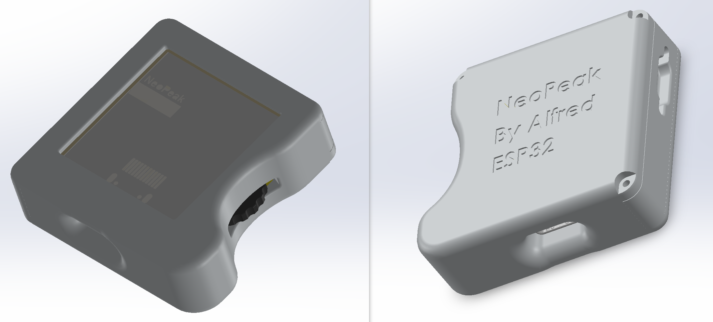

## 说明

NeoPeak 是基于 [Peak](https://github.com/peng-zhihui/Peak) 项目的硬件和软件优化版本。

关于 Peak 项目本身的详细介绍，请参考 [Peak 项目的 README](https://github.com/peng-zhihui/Peak/blob/main/README.md)。

本项目记录了以下优化工作：

> 原 Peak 项目基于雅特力 AT32F403ACGU7 主控芯片。NeoPeak 将其迁移到 **ESP32 平台**，提供更好的性能、WiFi/BLE 连接能力和生态支持，同时对硬件和固件进行优化改进。

## 1. 硬件改进

### 芯片选择

原 Peak 项目使用雅特力 AT32F403ACGU7 主控。关于各芯片的详细对比分析，请参考 [Peak 项目的硬件部分](https://github.com/peng-zhihui/Peak/blob/main/README.md)。

NeoPeak 选择使用 **ESP32-PICO-V3-02** 作为主控芯片。

### 传感器和执行器

NeoPeak 的主要硬件改进包括：

- **更高性能的 IMU**：升级了惯性测量单元，提供更精准的运动和姿态检测 ICM-42688-P。
- **电动机震动反馈**：添加电动机震动功能，增强用户交互体验

## 2. 固件改进

关于软件架构设计（LVGL、页面调度、消息框架等框架层的详细说明），请参考 [Peak 项目的固件部分](https://github.com/peng-zhihui/Peak/blob/main/README.md)。

NeoPeak 基于这些框架在 ESP32 平台上的移植和优化经验，主要改进包括内存管理优化和 ESP32 平台特性适配等。

## 参考链接 

* [Peak](https://github.com/peng-zhihui/Peak)
* [LVGL](https://github.com/lvgl/lvgl)
* [Bing Maps Tile System](https://docs.microsoft.com/en-us/bingmaps/articles/bing-maps-tile-system?redirectedfrom=MSDN)
* [IOS ViewController](https://developer.apple.com/documentation/uikit/uiviewcontroller)
* [ESP32之软件SPI驱动及SPI、HSPI和VSPI的理解](https://blog.csdn.net/jdsnpgxj/article/details/100013357)
* [ESP32 程序的内存模型](https://zhuanlan.zhihu.com/p/345915256)
* [Heap Memory Allocation](https://docs.espressif.com/projects/esp-idf/en/latest/esp32/api-reference/system/mem_alloc.html)
* [Error: region `dram0_0_seg' overflowed by 31632 bytes](https://www.esp32.com/viewtopic.php?t=7131)
* [[ESP32] ld: region `dram0_0_seg’ overflowed by 156768 bytes](https://community.platformio.org/t/esp32-ld-region-dram0-0-seg-overflowed-by-156768-bytes/18753)